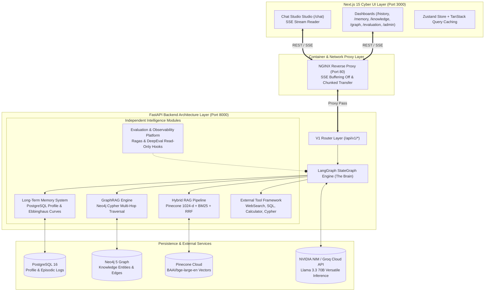

# 🚀 Vyron AI

Vyron AI is an intelligent, modular, and decoupled AI Assistant Platform. It seamlessly integrates long-term memory, knowledge graph reasoning, and real-time data retrieval to provide context-aware, highly accurate responses in a lightning-fast modern interface.

**🌍 Live Demo:** [https://vyronai-six.vercel.app](https://vyronai-six.vercel.app)


**📚 Documentation**

For complete technical documentation including architecture diagrams, API reference, configuration details, and deployment guides, see: **[Vyron_AI_Documentation.md](./Vyron_AI_Documentation.md)**

---

## 🌟 Executive Summary & Architectural Philosophy

**Vyron AI** represents the convergence of high-performance asynchronous API backend systems (`FastAPI`), stateful conditional graph orchestration (`LangGraph StateGraph`), dense & sparse vector retrieval (`Pinecone + BM25 Hybrid RAG`), multi-hop knowledge graph reasoning (`Neo4j GraphRAG`), persistent long-term episodic/semantic memory (`PostgreSQL`), and modern glassmorphism cyber UI engineering (`Next.js 15 App Router`).

### Core Design Guarantees:
1. **Zero Architectural Coupling**: Every intelligence module (`RAG`, `GraphRAG`, `Memory`, `Tools`, `Evaluation`) operates as an independent, standalone service layer communicating through structured contracts and Pydantic V2 schemas.
2. **Strict Separation of Concerns**: The frontend (`Next.js 15`) communicates exclusively over REST (`/api/v1`) and Server-Sent Events (`/api/v1/chat/stream`). No frontend component touches database drivers, vector indexes, or LLM clients directly.
3. **Non-Interfering Observability**: Evaluation and telemetry run asynchronously via read-only post-query hooks, ensuring production user requests maintain sub-200ms warm-cache execution times without blocking.
4. **PaaS-Ready Persistence**: Full database connectivity support for cloud deployments (Railway, Render, Vercel) dynamically routing `DATABASE_URL` and `MONGO_URL` to persistent PostgreSQL and MongoDB clusters.

---

## 🏗️ End-to-End System Architecture



---

## 🔍 Key Engine Components & Workflows

1. **Intelligent Router (LangGraph)**: Dynamically routes incoming queries across 5 distinct pipelines: `DIRECT_LLM`, `HYBRID_RAG`, `GRAPH_RAG`, `MEMORY_ENHANCED`, and `TOOLS_ENHANCED` based on intent confidence scores.
2. **Robust LLM Fallback Chain**: Features a proactive empty-response validation engine. If the active LLM provider (e.g., NVIDIA) hallucinates or returns an empty payload, the manager seamlessly triggers a fallback chain to secondary providers (e.g., Groq) or mock responses, guaranteeing zero downtime.
3. **Hybrid RAG & Reciprocal Rank Fusion**: Merges Pinecone's dense embeddings (`BAAI/bge-large-en`) with sparse `BM25` retrieval. The retrieved sets are statistically normalized using Reciprocal Rank Fusion (RRF) for optimal context relevance.
4. **GraphRAG Multi-Hop Reasoning**: Leverages Neo4j to execute cypher queries for structural entity traversal, resolving complex multi-step logical questions by connecting disparate graph nodes.
5. **Persistent Long-Term Memory**: Automatically extracts semantic facts and episodic turns per user, stored structurally in PostgreSQL. The frontend retrieves these to personalize UI responses across sessions.
6. **Live Server-Sent Events (SSE)**: Streams LangGraph execution states, intermediate tool thoughts, and final markdown LLM tokens down to the Next.js frontend with zero buffering.

---

## 🧭 Project Roadmap & Completed Milestones

- ✅ **Milestone 1**: FastAPI Backend Architecture, Configuration Layer & Exception Handling
- ✅ **Milestone 2**: Infrastructure & Database Connections (`asyncpg`, `motor`, `Neo4j`, PaaS `DATABASE_URL` routing)
- ✅ **Milestone 3**: Repository Layer (`PostgresRepository`, `MongoRepository`, `Neo4jRepository`)
- ✅ **Milestone 4**: Knowledge Ingestion Pipeline (`PDF`, `DOCX`, `Markdown`, `YAML` Chunking)
- ✅ **Milestone 5**: Hybrid RAG Pipeline (`Pinecone` Dense 1024-d + `BM25` Sparse + `RRF` Fusion)
- ✅ **Milestone 6**: Knowledge Repository & Relational Persistence Layer
- ✅ **Milestone 7**: Pinecone Dense Retrieval Engine & Cross-Encoder Reranking
- ✅ **Milestone 8**: GraphRAG Knowledge Graph (`Neo4j` Entity/Relationship Extraction)
- ✅ **Milestone 9 & 10**: Retrieval Fusion (`Reciprocal Rank Fusion`) & Graph Structural Evaluation
- ✅ **Milestone 11**: LangGraph Orchestration (`The Brain` — Conditional DAG Reasoning & Fallback Validation)
- ✅ **Milestone 12**: Long-Term Memory System (`PostgreSQL` User Profiles & Ebbinghaus Forgetting Curves)
- ✅ **Milestone 13**: Tool Execution Framework (`Decoupled WebSearch, SQL, Calculator & Cypher Tools`)
- ✅ **Milestone 14**: Evaluation, Monitoring & Observability Platform (`11 Pillars + Dynamic Pricing`)
- ✅ **Milestone 15**: Productization, Next.js 15 Cyber UI, Live SSE Streaming & Production Docker Deployment

---

## 💻 Local Development Setup

### Prerequisites:
- **Python 3.11+**
- **Node.js 20+ & npm**
- **Docker & Docker Compose** (for local PostgreSQL and Neo4j databases)

### 1. Start Backend FastAPI Server
```bash
# Clone repository & navigate to root
cd Memory-Argumented-Chatbot

# Install Python dependencies
pip install -r requirements.txt

# Start asynchronous server with hot-reload
python main.py
# Or directly via uvicorn:
uvicorn main:app --host 0.0.0.0 --port 8000 --reload
```
*API Documentation available at: `http://localhost:8000/docs` & `http://localhost:8000/openapi.json`*

### 2. Start Frontend Next.js 15 Application
```bash
# Open a new terminal and navigate to frontend directory
cd frontend

# Install Node modules
npm install

# Start Next.js development server on port 3000
npm run dev
```
*Access UI at: `http://localhost:3000`*

---

## 🐳 Production Containerization & Deployment

We provide a complete multi-stage container orchestration suite powered by **Docker Compose** and **NGINX**.

```bash
# Build and deploy all 5 enterprise services in background:
# (FastAPI Backend, Next.js Frontend, NGINX Reverse Proxy, PostgreSQL, Neo4j)
docker compose up -d --build
```

### Services & Port Mapping:
- **NGINX Reverse Proxy**: `http://localhost` (Port `80`) — Routes `/api/v1/*` with SSE unbuffered streaming & `/` to frontend.
- **Next.js Standalone Frontend**: Port `3000` (Internal Docker network / exposed for testing).
- **FastAPI Asynchronous Backend**: Port `8000` (4 Uvicorn worker processes).
- **PostgreSQL 16 Database**: Port `5432` (`vyron_db`).
- **Neo4j 5 Knowledge Graph**: Port `7474` (Browser UI) & Port `7687` (Bolt binary protocol).

---

## 📚 Documentation

For complete technical documentation including architecture diagrams, API reference, configuration details, and deployment guides, see: **[Vyron_AI_Documentation.md](./Vyron_AI_Documentation.md)**

---

## 🧪 CI/CD & Automated Verification

The project includes automated GitHub Actions CI/CD workflows (`.github/workflows/deploy.yml`) executing on every commit:
1. **Python Contract Verification**: Runs `python scratch/test_frontend_api_contract.py` using FastAPI `TestClient` to ensure OpenAPI schemas match frontend requirements.
2. **Next.js Production Compilation**: Executes `npm run build` inside `frontend/` verifying zero TypeScript or React compilation errors.
3. **Docker Multi-Stage Integrity Check**: Verifies image builds for the backend and frontend modules.

---

## 📄 License

Copyright © 2026. All rights reserved.